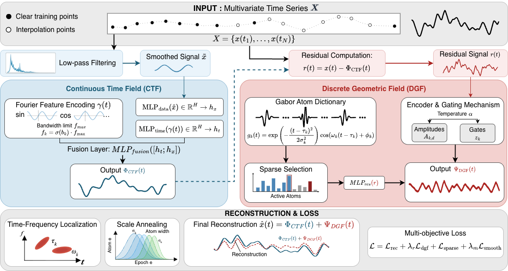

# DualTimesField

**Rethinking the Nature of Time Series: A Dual Neural Field Perspective**

DualTimesField proposes that time series signals inherently consist of two complementary components—smooth continuous manifolds and sparse geometric events. By combining Implicit Neural Representations (INR) with learnable Gabor atoms, we achieve efficient compression, accurate interpolation, and interpretable decomposition.

## Overview

Time series signals exhibit a fundamental **dual structure**:

$$
\mathbf{x}(t) = \Phi_{\text{CTF}}(t) + \Psi_{\text{DGF}}(t)
$$

| Component | Description | Mathematical Basis |
|-----------|-------------|-------------------|
| **CTF** | Continuous Time Field for smooth trends | Band-limited Fourier features + MLP |
| **DGF** | Discrete Geometric Field for sparse events | Learnable Gabor atoms with gate mechanism |



## Key Features

- **Dual-field decomposition**: Separates smooth trends from sparse transient events
- **Dynamic sparsity**: Gate mechanism adaptively selects active atoms based on signal complexity
- **Multiple tasks**: Supports both compression/reconstruction and interpolation
- **High accuracy**: Achieves state-of-the-art results on PhysioNet and USHCN interpolation benchmarks
- **Interpretable representation**: Each Gabor atom has explicit location, scale, frequency, and amplitude
- **Advanced visualization**: T-SNE, PCA, error heatmaps, and temporal analysis

## Installation

```bash
git clone https://github.com/WisdomTogether/DualTimesField.git
cd DualTimesField
pip install -r requirements.txt
```

## Quick Start

### Compression/Reconstruction

```bash
# Train compression model
python -m reconstruction.train --datasets ETTh1 ETTh2 --epochs 300

# Evaluate trained model
python -m reconstruction.evaluate --datasets ETTh1

# Compare with baselines
python -m reconstruction.compare --datasets ETTh1 --models DualTimesField SIREN WIRE
```

### Interpolation

```bash
# Train interpolation model
python -m interpolation.train --dataset physionet --epochs 500

# Generate visualizations
python -m interpolation.visualize

# Advanced visualizations (T-SNE, PCA, heatmaps)
python -m interpolation.visualize --advanced
```

## Project Structure

```
DualTimesField/
├── src/dualfield/              # Core module (shared across tasks)
│   ├── core.py                 # DualTimesField core model
│   │   ├── ContinuousTimeField # CTF component
│   │   ├── DiscreteGeometricField # DGF component
│   │   └── DualTimesField      # Main model
│   ├── losses.py               # Loss functions
│   ├── metrics.py              # Evaluation metrics
│   ├── trainer.py              # Training utilities
│   └── utils/                  # Helper functions
│
├── reconstruction/             # Compression/reconstruction task
│   ├── datasets.py             # Data loaders
│   ├── baselines.py            # Baseline models (SIREN, WIRE, N-BEATS, etc.)
│   ├── train.py                # Training script
│   ├── evaluate.py             # Evaluation script
│   └── compare.py              # Multi-model comparison
│
├── interpolation/              # Interpolation task
│   ├── models.py               # Task-specific interpolation model
│   ├── datasets.py             # PhysioNet & USHCN datasets
│   ├── train.py                # Training script
│   └── visualize.py            # Visualization tools
│
├── outputs/                    # Results and visualizations
│   ├── interpolation/          # Interpolation results
│   └── reconstruction/         # Reconstruction results
│
└── data/                       # Dataset directory
```

## Model Architecture

### Continuous Time Field (CTF)

Captures smooth, low-frequency components using:
- Learnable Fourier features with frequency cutoff constraint
- MLP with GELU activation
- Low-pass filtering for trend extraction

### Discrete Geometric Field (DGF)

Models sparse, localized events using:
- Gabor wavelets: $g_k(t) = \exp\left(-\frac{(t-\tau_k)^2}{2\sigma_k^2}\right) \cos(\omega_k(t-\tau_k) + \phi_k)$
- Gate mechanism for dynamic sparsity (target: 30% activation)
- Scale annealing for optimization stability
- Residual network for fine-grained adjustments

### Training Strategy

- **Initialization**: Atom parameters initialized from residual FFT analysis
- **Loss function**: Reconstruction + DGF residual + sparsity + smoothness
- **Optimization**: AdamW with cosine annealing scheduler
- **Gradient clipping**: Max norm 1.0 for stability

## Experimental Results

### Interpolation Performance


### Time-series Reconstruction Results


### Interpolation Task

**PhysioNet (Irregular Medical Time Series)**

| Method | MSE (×10⁻³) | Rank |
|--------|-------------|------|
| **DualTimesField** | **0.30 ± 0.22** | 🥇 1st |
| LS4 | 0.63 | 2nd |
| ODE-RNN | 2.23 | 3rd |
| RNN | 2.92 | 4th |
| GRU-D | 3.33 | 5th |
| iHT | 3.35 | 6th |
| RNN-VAE | 5.93 | 7th |
| Latent ODE | 8.34 | 8th |

**USHCN (Climate Data)**

| Method | MSE (×10⁻³) | Rank |
|--------|-------------|------|
| LS4 | 0.06 | 1st |
| **DualTimesField** | **0.17 ± 0.13** | 🥈 2nd |
| iHT | 1.46 | 3rd |
| ODE-RNN | 2.47 | 4th |
| GRU-D | 3.40 | 5th |
| RNN | 4.32 | 6th |
| Latent ODE | 6.86 | 7th |
| RNN-VAE | 7.56 | 8th |

**Key Findings**:
- **R² = 0.9975** on PhysioNet (near-perfect correlation)
- **R² = 0.9853** on USHCN
- Error distribution centered at zero (no systematic bias)
- Consistent performance across time positions (no boundary effects)

### Visualization Analysis

Our advanced visualization toolkit reveals:

1. **T-SNE Embedding**: Low-error predictions cluster in dense manifold regions; high-error points are outliers
2. **Error Heatmap**: Most variables have uniformly low errors; specific variables (e.g., USHCN Var 3, 4) are inherently harder to predict
3. **Temporal Analysis**: Error distribution is uniform across time, indicating no edge effects
4. **PCA Analysis**: PC1 explains 35.5% variance; samples well-distributed in latent space

## Datasets

### Reconstruction Task
- **ETT**: ETTh1, ETTh2, ETTm1, ETTm2 (Electricity Transformer Temperature)
- **Energy**: Electricity consumption
- **Finance**: Exchange Rate
- **Environment**: Weather measurements
- **Transportation**: Traffic flow
- **Healthcare**: Illness statistics

### Interpolation Task
- **PhysioNet**: Irregular medical time series (35 variables, ICU patients)
- **USHCN**: Climate data (5 variables, irregular sampling)

## Usage Examples

### Import Core Model

```python
from src.dualfield import DualTimesField

# Create model
model = DualTimesField(
    num_variables=7,
    seq_length=336,
    num_frequencies=16,
    hidden_dim=64,
    num_atoms=16
)

# Forward pass
output, ctf_out, dgf_out = model(x, t)

# Get model statistics
stats = model.get_compression_stats()
print(f"Active atoms: {stats['active_atoms']}")
```

### Interpolation Example

```python
from interpolation.models import DualTimesFieldInterpolator
from interpolation.datasets import PhysioNetDataset, create_interpolation_task

# Load dataset
dataset = PhysioNetDataset(split='test')
sample = dataset[0]

# Create interpolation task (50% observed)
observed_mask, target_mask = create_interpolation_task(
    sample['times'], 
    sample['values'], 
    sample['mask'], 
    sample_rate=0.5
)

# Train model
model = DualTimesFieldInterpolator(num_variables=35, embed_dim=128)
model.fit(
    sample['times'], 
    sample['values'], 
    observed_mask, 
    target_mask=target_mask,
    num_epochs=500
)

# Predict
predictions = model.predict(sample['times'])
```

## Hyperparameters

### Reconstruction Task
- `seq_length`: 336-512 (sequence length)
- `num_frequencies`: 16 (Fourier features)
- `num_atoms`: 16 (Gabor atoms)
- `hidden_dim`: 64
- `sparsity_lambda`: 0.001
- `smoothness_lambda`: 0.001
- `lr`: 1e-3
- `epochs`: 300

### Interpolation Task
- `embed_dim`: 128 (PhysioNet), 128 (USHCN)
- `num_frequencies`: 32
- `num_atoms`: 32
- `lr`: 5e-4
- `epochs`: 500 (PhysioNet), 300 (USHCN)

## Citation

```bibtex
@article{dualtimesfield2026,
  title={DualTimesField: Dual Neural Field for Time Series Compression and Interpolation},
  author={},
  journal={},
  year={2026}
}
```

## References

### Baseline Methods
1. Sitzmann et al. "SIREN: Implicit Neural Representations with Periodic Activation Functions." NeurIPS 2020.
2. Saragadam et al. "WIRE: Wavelet Implicit Neural Representations." CVPR 2023.
3. Oreshkin et al. "N-BEATS: Neural Basis Expansion Analysis for Interpretable Time Series Forecasting." ICLR 2020.
4. Wu et al. "TimesNet: Temporal 2D-Variation Modeling for General Time Series Analysis." ICLR 2023.

### Interpolation Benchmarks
5. De Brouwer et al. "GRU-ODE-Bayes: Continuous Modeling of Sporadically-Observed Time Series." NeurIPS 2019.
6. Rubanova et al. "Latent ODEs for Irregularly-Sampled Time Series." NeurIPS 2019.
7. Shukla & Marlin. "Interpolation-Prediction Networks for Irregularly Sampled Time Series." ICLR 2019.

## Acknowledgments

We thank the authors of baseline methods for open-sourcing their implementations. Special thanks to:
- [GRU-ODE-Bayes](https://github.com/edebrouwer/gru_ode_bayes) for PhysioNet and USHCN datasets
- [CRU](https://github.com/boschresearch/Continuous-Recurrent-Units) for data preprocessing code

## License

MIT License
