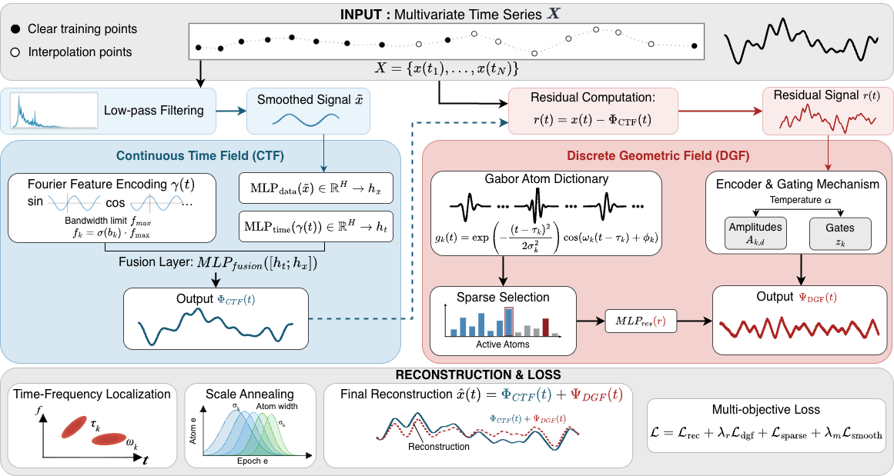
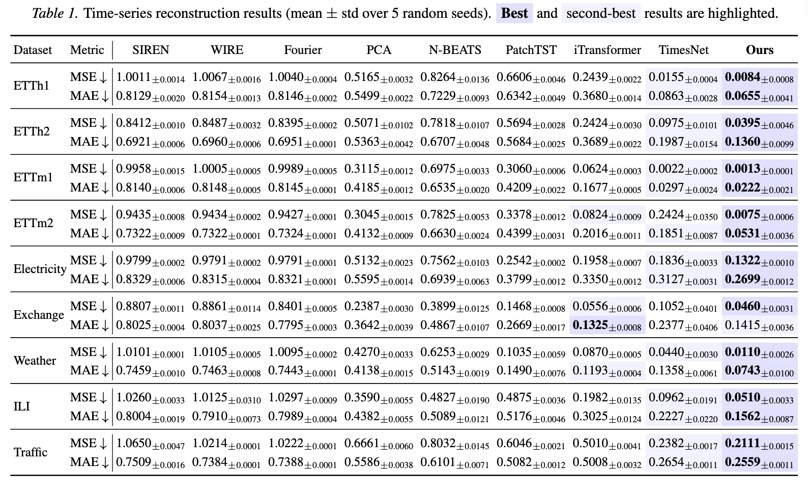
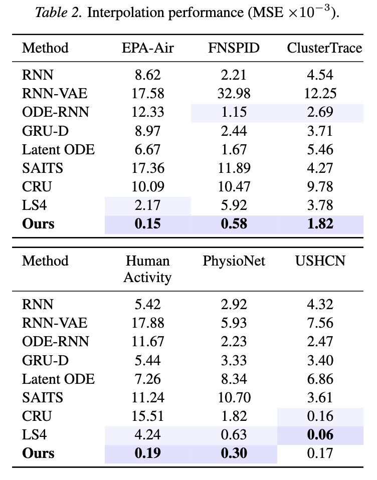

# DualTimesField

**Rethinking Time Series as Continuous-Time Trends and Events**

<p align="center">
  
</p>

**Accepted at ICML 2026 (Seoul, South Korea).** Proceedings of the 43rd International Conference on Machine Learning.

DualTimesField conceptualizes time series as the superposition of continuous trends and discrete events from a continuous-time perspective. By coupling bandwidth-limited Implicit Neural Representations (INR) with learnable Gabor atoms, it overcomes the spectral bias and frequency entanglement of single-field INRs and the resolution/irregularity limits of discrete-time models.

## Overview

A signal is decomposed via two complementary neural fields:

$$
\hat{\mathbf{x}}(t) = \Phi_{\text{CTF}}(t;\theta_c) + \Psi_{\text{DGF}}(t;\theta_d)
$$

| Component | Description | Mathematical Basis |
|-----------|-------------|-------------------|
| **CTF** (Continuous Time Field) | Smooth, low-frequency trends | Bandwidth-limited learnable Fourier features + low-pass filtering + MLP |
| **DGF** (Discrete Geometric Field) | Sparse, localized transient events | Learnable Gabor atoms with gated sparsity + coarse-to-fine scale annealing |

## Key Features

- **Explicit trend–event decomposition** — structurally prevents trend/event interference instead of relying on implicit disentanglement
- **Bandwidth-limited parameterization** — explicit spectral cutoffs enforce frequency separation between the two fields
- **Gated sparse event modeling** — context-dependent amplitudes and gates adaptively activate atoms based on signal complexity
- **Coarse-to-fine scale annealing** — atoms first localize broadly, then sharpen, avoiding the non-convexity of narrow basis functions
- **Continuous-time inference** — query at arbitrary timestamps, native support for irregular sampling
- **Interpretable atoms** — each active Gabor atom has explicit \((\tau, \sigma, \omega, \phi)\) semantics for event location, duration, frequency, phase

## Installation

```bash
git clone https://github.com/WisdomTogether/DualTimesField.git
cd DualTimesField
pip install -r requirements.txt
```

## Quick Start

### Reconstruction

```bash
# Train reconstruction model
python -m reconstruction.train --datasets ETTh1 ETTh2 --epochs 300

# Evaluate
python -m reconstruction.evaluate --datasets ETTh1

# Compare with baselines
python -m reconstruction.compare --datasets ETTh1 \
    --models DualTimesField SIREN WIRE Fourier PCA N-BEATS PatchTST iTransformer TimesNet

# Multi-seed comparison (5 seeds, incremental CSV updates)
python -m reconstruction.run_multi_seed_comparison --datasets ETTh1 --models DualTimesField SIREN
```

### Interpolation (Irregularly Sampled Data)

```bash
# Run interpolation experiment (recommended entry point)
python -m interpolation.run_experiments --dataset physionet --num-epochs 1000 --lr 1e-3

# Other supported datasets:
# physionet | ushcn | personactivity | epa-air | clustertrace | fnspid

# Generate visualizations
python -m interpolation.visualize
```

> **Note:** On high-dimensional datasets (e.g. `traffic` with 862 variables), transformer baselines such as PatchTST may require a smaller `--batch_size` to fit in GPU memory.

## Project Structure

The layout below matches the repository code (excluding generated artifacts such as `outputs/`, checkpoints, and downloaded data under `data/`):

```
DualTimesField/
├── pics/                       # Figures for README and paper
│   ├── DualTimesField.png
│   ├── reconstruction.png
│   └── interpolation.png
├── docs/
│   └── mathtype.md             # MathType / equation notes
├── src/dualfield/              # Core module (shared)
│   ├── core.py                 # DualTimesField core model
│   │   ├── ContinuousTimeField   # CTF — bandwidth-limited trend field
│   │   ├── DiscreteGeometricField # DGF — gated Gabor atom field
│   │   └── DualTimesField        # Joint model
│   ├── losses.py               # Multi-objective loss (rec + dgf + sparse + smooth)
│   ├── metrics.py              # MSE / MAE / R²
│   └── trainer.py              # Training utilities + scale annealing schedule
│
├── reconstruction/             # Long-horizon reconstruction task
│   ├── datasets.py             # ETT, Electricity, Exchange, Traffic, Weather, ILI
│   ├── baselines.py            # SIREN, WIRE, Fourier, PCA, N-BEATS, PatchTST, iTransformer, TimesNet
│   ├── train.py
│   ├── evaluate.py
│   ├── compare.py
│   └── run_multi_seed_comparison.py
│
├── interpolation/              # Interpolation task on irregular data
│   ├── models.py
│   ├── datasets.py             # PhysioNet, USHCN, PersonActivity, EPA-Air, ClusterTrace, FNSPID
│   ├── baseline_results.py     # Published baseline numbers for comparison tables
│   ├── train.py                # Per-sample training loop
│   ├── run_experiments.py      # CLI for dataset experiments
│   ├── run.sh                  # Batch runner (PhysioNet + USHCN)
│   ├── utils.py
│   └── visualize.py
│
├── outputs/                    # Generated locally (not required for release)
└── data/                       # Downloaded / preprocessed datasets (not shipped)
```

## Model Architecture

### Continuous Time Field (CTF)

- Learnable Fourier features with explicit cutoff: \(f_k = \sigma(b_k) \cdot f_{\max}\)
- Frequency-domain low-pass filtering with smooth rolloff (cutoff at \(N/16\)) to avoid Gibbs artifacts
- Parallel time/data MLP encoders fused into the trend output
- First-order temporal smoothness regularization

### Discrete Geometric Field (DGF)

- Gabor atoms: \(g_k(t) = \exp\!\left(-\frac{(t-\tau_k)^2}{2\sigma_k^2}\right)\cos(\omega_k(t-\tau_k) + \phi_k)\)
- Context-conditioned amplitudes \(A \in \mathbb{R}^{M\times D}\) and gates \(z \in \mathbb{R}^M\) from observed mean
- Sparsity loss with target activation \(\rho = 0.3\)
- Spectral-guided initialization (atom frequencies = dominant FFT peaks; centers = energy peaks with local suppression)

### Training

- **Loss**: \(\mathcal{L} = \mathcal{L}_{\text{rec}} + \lambda_r \mathcal{L}_{\text{dgf}} + \mathcal{L}_{\text{sparse}} + \lambda_m \mathcal{L}_{\text{smooth}}\)
- **Scale annealing**: cosine schedule from \(\eta=1\) (broad atoms) to \(\eta=0\) (sharp atoms) after a 30% warmup
- **Optimizer**: AdamW (lr \(10^{-3}\), weight decay \(10^{-4}\)), gradient clipping at 1.0
- **Reparameterizations**: \(\sigma_k = \text{softplus}(\tilde\sigma_k) + \epsilon\), \(\omega_k = \text{softplus}(\tilde\omega_k)\)

## Experimental Results

### Reconstruction (9 long-horizon benchmarks, mean over 5 seeds)

<p align="center">
  
</p>

DualTimesField achieves the best MSE on all 9 benchmarks, with a 51.2% average MSE reduction and 29.8% average MAE reduction over the strongest deep-learning baseline (TimesNet). Largest gains: ETTm2 (96.9%), Weather (75.0%), ETTh2 (59.5%).

### Interpolation on Irregularly Sampled Data (MSE ×10⁻³)

<p align="center">
  
</p>

Best on 5 of 6 datasets. On PhysioNet, DualTimesField cuts MSE by 52.4% over LS4. On EPA-Air and Human Activity, the margin exceeds 90%. USHCN remains slightly better for state-space methods (LS4, CRU), which aligns with our design intuition: USHCN is dominated by smooth seasonal patterns with few localized events, the regime where explicit event modeling has limited returns.

### Interpretable Decomposition (ECG5000)

On the ECG5000 dataset, the dual-field decomposition recovers clinically meaningful structure without any supervision on heartbeat categories:

- **Normal beats** — minimal DGF activation, CTF tracks the full waveform
- **R-on-T PVC** — concentrated late-phase atom activation matching abnormal ventricular depolarization
- **Supraventricular** — dual activation peaks for the characteristic double-bump morphology
- **PVC** — multiple distributed atoms capturing complex multi-component transients

All reconstructions achieve MSE &lt; 1.2 × 10⁻².

## Datasets

### Reconstruction (Regularly Sampled, 9 Long-Horizon Benchmarks)

- **ETT**: ETTh1, ETTh2, ETTm1, ETTm2 (Electricity Transformer Temperature)
- **Electricity**: ElectricityLoadDiagrams (321 variables)
- **Exchange**: Exchange Rate
- **Weather**: BGC Jena meteorological station
- **Traffic**: PEMS-SF (862 sensors)
- **ILI**: CDC FluView Influenza-Like Illness surveillance

### Interpolation (Irregularly Sampled, 6 Benchmarks)

- **PhysioNet**: Multivariate ICU records, asynchronous observations (auto-download supported)
- **USHCN**: Long-term climate records, 5 variables, irregular masks (auto-download supported)
- **Person Activity** (`personactivity`): 3D body-sensor positions with asynchronous timestamps (Shukla & Marlin protocol)
- **EPA-Air** (`epa-air`): Air quality monitoring (trigger-based irregularity)
- **ClusterTrace** (`clustertrace`): Cloud-computing cluster traces (constraint-based irregularity)
- **FNSPID** (`fnspid`): Financial news with stock prices (artifact-based irregularity)

## Usage Examples

### Core Model

```python
from src.dualfield import DualTimesField

model = DualTimesField(
    num_variables=7,
    seq_length=336,
    num_frequencies=16,
    hidden_dim=64,
    num_atoms=16,
)

output, ctf_out, dgf_out = model(x, t)

print(f"Active atoms: {model.dgf.get_active_atoms()}")
```

### Interpolation

```python
from interpolation.models import DualTimesFieldInterpolator
from interpolation.datasets import PhysioNetDataset, create_interpolation_task

dataset = PhysioNetDataset(split='test')
sample = dataset[0]

observed_mask, target_mask = create_interpolation_task(
    sample['times'], sample['values'], sample['mask'], sample_rate=0.5,
)

model = DualTimesFieldInterpolator(num_variables=sample['values'].shape[1], embed_dim=128)
model.fit(
    sample['times'], sample['values'],
    observed_mask, target_mask=target_mask,
    num_epochs=500,
)

predictions = model.predict(sample['times'])
```

## Default Hyperparameters

| Parameter | Symbol | Value | Parameter | Symbol | Value |
|-----------|--------|-------|-----------|--------|-------|
| Number of frequencies | \(K\) | 16 | DGF loss weight | \(\lambda_r\) | 0.1 |
| Frequency cutoff | \(f_{\max}\) | 8.0 Hz | Smoothness weight | \(\lambda_m\) | 0.001 |
| Hidden dimension | \(H\) | 64 | Base scale | \(\sigma_{\text{base}}\) | 0.1 |
| Number of atoms | \(M\) | 16 | Scale floor | \(\epsilon\) | 0.02 |
| Gate temperature | \(\alpha\) | 5 | Warmup ratio | \(e_{\text{warm}}/E\) | 0.3 |
| Target sparsity | \(\rho\) | 0.3 | Learning rate | — | \(10^{-3}\) |
| Sparsity penalty | \(\beta\) | 10 | Weight decay | — | \(10^{-4}\) |
| Sparsity weight | \(\lambda_s\) | 0.001 | Gradient clip norm | — | 1.0 |

Typical model size: ~35K parameters (\(D=7\), \(K=16\), \(M=16\), \(H=64\)). Training: 2–5 min for reconstruction (300 epochs, batch 32) and 10–30 min per sample for interpolation (500 epochs) on a single RTX 3090.

## Citation

If you find this work useful, please cite:

```bibtex
@inproceedings{zhang2026dualtimesfield,
  title     = {DualTimesField: Rethinking Time Series as Continuous-Time Trends and Events},
  author    = {Zhang, Wencheng and Li, Long and Qin, Huayi and Wu, Zongjuan and Li, Jing and Chen, Wanghu},
  booktitle = {Proceedings of the 43rd International Conference on Machine Learning (ICML)},
  series    = {Proceedings of Machine Learning Research},
  year      = {2026},
  address   = {Seoul, South Korea},
  publisher = {PMLR},
}
```

## References

### Reconstruction Baselines

1. Sitzmann et al. SIREN: Implicit Neural Representations with Periodic Activation Functions. NeurIPS 2020.
2. Saragadam et al. WIRE: Wavelet Implicit Neural Representations. CVPR 2023.
3. Tancik et al. Fourier Features Let Networks Learn High Frequency Functions in Low Dimensional Domains. NeurIPS 2020.
4. Oreshkin et al. N-BEATS: Neural Basis Expansion Analysis for Interpretable Time Series Forecasting. ICLR 2020.
5. Nie et al. PatchTST: A Time Series is Worth 64 Words. ICLR 2023.
6. Liu et al. iTransformer: Inverted Transformers Are Effective for Time Series Forecasting. ICLR 2024.
7. Wu et al. TimesNet: Temporal 2D-Variation Modeling for General Time Series Analysis. ICLR 2023.

### Interpolation Baselines

1. Chung et al. RNN-VAE / GRU. arXiv 2014.
2. Che et al. GRU-D: Recurrent Networks for Multivariate Time Series with Missing Values. Scientific Reports 2018.
3. Rubanova et al. Latent ODE / ODE-RNN for Irregularly-Sampled Time Series. NeurIPS 2019.
4. Du et al. SAITS: Self-Attention-based Imputation for Time Series. ESWA 2023.
5. Schirmer et al. CRU: Modeling Irregular Time Series with Continuous Recurrent Units. ICML 2022.
6. Zhou et al. LS4: Deep Latent State Space Models for Time-Series Generation. ICML 2023.

### Datasets

1. PhysioNet/CinC Challenge 2012 (Silva et al.)
2. USHCN Climate Network (Menne et al.)
3. Time-IMM benchmark (Chang et al., NeurIPS 2025 D&B) for EPA-Air, ClusterTrace, FNSPID
4. FNSPID (Dong et al., KDD 2024)
5. Human Activity protocol (Shukla & Marlin, ICLR 2021)

## Acknowledgments

This work was supported by the National Natural Science Foundation of China (Grant No. 62462059).

We thank the authors of the baseline methods for open-sourcing their implementations, and in particular:

- [GRU-ODE-Bayes](https://github.com/edebrouwer/gru_ode_bayes) for PhysioNet and USHCN data
- [CRU](https://github.com/boschresearch/Continuous-Recurrent-Units) for data preprocessing
- Time-IMM for irregular benchmarks

## License

MIT License
